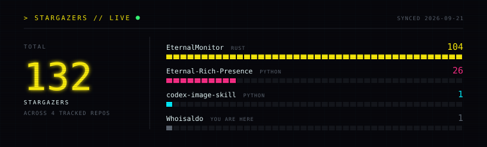
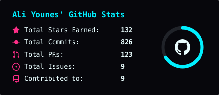
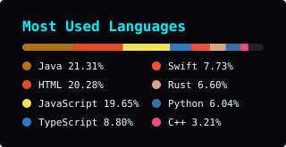

<div align="center">




<br/>

[](https://aliyounes.dev) [](https://aliyounes.dev/resume) [](https://www.linkedin.com/in/alialdoyounes/) [](mailto:younes.al@northeastern.edu)

</div>

<div align="center"></div>

## `> whoami`

```yaml
handle:     "whoisaldo"
name:       "Ali Younes"
now:        "SDE Intern @ AWS CloudFormation — Registry control plane"
also:       "Co-founder @ Eternal Reverse — two-person studio, Boston"
prev:       "SWE Co-op @ Philips — FDA-regulated deployment infrastructure"
location:   "Seattle, WA  ->  Boston, MA"
education:
  school:   "Northeastern University"
  majors:   ["Computer Science", "Political Science"]
  grad:     2027
languages:  ["Rust", "Swift", "Java", "TypeScript", "Python", "C#", "C++", "Go"]
domains:    ["Systems", "iOS", "Web", "Cloud control planes", "Deployment infra"]
philosophy: "ship the thing, then prove the number"
interests:  ["Powerlifting", "Wrestling", "Developer tooling", "German car tuning"]
```

<div align="center"></div>

## `> gh repo list whoisaldo --sort=stars`

<div align="center">

[](https://github.com/whoisaldo/EternalMonitor) [](https://github.com/whoisaldo/Eternal-Rich-Presence)



</div>

<!-- STARS:START -->
```
SIGNAL // stargazers across whoisaldo   ·   synced 2026-09-01
──────────────────────────────────────────────────────────────────
EternalMonitor         ████████████████████████████  120  Rust
Eternal-Rich-Presence  ███████                        29  Python
codex-image-skill      ▏                               1  Python
Whoisaldo              ▏                               1  you are here
──────────────────────────────────────────────────────────────────
TOTAL                                                151
```
<!-- STARS:END -->

<div align="center"></div>

## `> ls ./projects --all`

**[EternalMonitor](https://github.com/whoisaldo/EternalMonitor)** · [eternalmonitor.dev](https://eternalmonitor.dev)  
> Use an iPad as a wireless second display for Windows. A Rust host captures via DXGI Desktop Duplication, hardware-encodes H.264 through an auto-probed NVENC → AMF → QSV → libx264 chain, and fragments frames behind a custom 16-byte UDP header. The iPad client decodes on VideoToolbox and presents through a Metal-backed `MTKView`. UDP over TCP was deliberate — a dropped frame should be a dropped frame, not head-of-line blocking.
>
> Ships a one-click signed installer with a virtual extended-display driver.
>
> `v0.1.2-mirror` · mirrors the primary display · ~5.9k lines Rust, ~3.7k Swift · MIT

`Rust` `Swift` `DXGI` `H.264` `VideoToolbox` `Metal` `FlatBuffers` `tokio` `mDNS`

---

**[EternalRichPresence](https://github.com/whoisaldo/Eternal-Rich-Presence)** · [eternalrichpresence.dev](https://eternalrichpresence.dev)  
> Apple Music does not talk to Discord, and Discord's Listen Along is Spotify-only. This bridges both. Reads now-playing from the iTunes COM interface and Windows SMTC, pushes to Discord via pypresence, and uploads cover art with a litterbox → 0x0 → catbox fallback chain.
>
> The part worth reading: pypresence is send-only, so Listen Along was impossible with it. The app opens Discord's IPC named pipes (`\\.\pipe\discord-ipc-0..9`) directly over ctypes/kernel32, speaks the frame protocol by hand, and subscribes to `ACTIVITY_JOIN` — registering `eternalrp://` in HKCU so a join link works without admin rights.
>
> `v1.0.0-beta` · 74 tests across ~3.9k lines · SHA-256 published per release

`Python` `WinRT/SMTC` `COM` `Discord IPC` `spotipy` `pystray` `PyInstaller`

---

**[Eternal Reverse](https://eternalreverse.com)** — co-founder 
> Two-person indie software studio in Boston, founded 2025. Ships its own products instead of doing client work — six of them, spanning systems engineering, native iOS, video pipelines and modern web. I write the Rust + Swift behind EternalMonitor, the SwiftUI app and Node API behind Exerly, and the studio site itself.

`Next.js` `TypeScript` `Rust` `SwiftUI` `Node.js` `Tailwind` `Framer Motion`

---

**[EternalExchange](https://github.com/whoisaldo/EternalExchange)** · [eternalexchangemod.com](https://eternalexchangemod.com) 
> ProjectE is the canonical equivalent-exchange Minecraft mod and it is Forge-only. Fabric had nothing comparable, so this is the Fabric-native spin-off — credited openly in the README and LICENSE.
>
> The centrepiece is the EMC solver: at server start and after every `/reload` it walks the entire loaded recipe graph and propagates values outward from a seed set, using exact `BigFraction` arithmetic so fractional intermediates never drift into rounding errors. Add another mod and its recipes get priced automatically, no patch required. Fabric lacks the primitives the original assumes, so it carries a 2,031-line compatibility layer and 9 Mixins standing in for hooks Fabric never fires.
>
> `v1.0.0` pre-release · 39,399 LOC across 450 files · save-compatible with the NeoForge original

`Java 21` `Fabric` `Mixin` `Gradle · Loom` `Commons Math`

---

**[Exerly Fitness](https://github.com/whoisaldo/Exerly-Fitness)** · [exerlyfitness.com](https://exerlyfitness.com) 
> Every commercial fitness app is paywalled, so this one is free and open source. 50+ users. An npm-workspaces monorepo (`apps/api`, `apps/web`, `apps/ios`) behind one REST backend, so the browser and the phone read the same account. The AI coach builds its prompt from your real profile — age, weight, goals, logged progress — rather than answering in a vacuum.
>
> Web is live. The iOS client is written and waiting on App Store review: 71 Swift files, ~9k lines, 12-step onboarding computing maintenance calories via Mifflin-St Jeor.

`SwiftUI` `HealthKit` `React 19` `TypeScript` `Express 5` `MongoDB` `SQLite` `Gemini 2.0 Flash-Lite`

---

<details>
<summary><code>&gt; ls ./projects --archived</code></summary>

<br/>

| project | what it is | stack |
|---|---|---|
| [Moops Bookstore](https://moopsbooks.com) | Social reading tracker — shelves, clubs, streaks, Google Books search. Source private. | `MERN` `JWT` |
| [Signature Cuts 413](https://signaturecutschicopee.com) | Barbershop site with a booking flow that compiles to a WhatsApp deeplink. No backend to keep alive. | `Next.js 14` `SSG` |
| [Real-Time Face Analytics](https://whoisaldo.github.io/real-time-face-analytics/) | Face, emotion, age and gender detection running fully in-browser. No frames leave the device. | `TF.js` `face-api.js` |
| [BetterAppleMusic](https://github.com/whoisaldo/BetterAppleMusic) | Windows desktop Apple Music client. | `Electron` `MusicKit JS` |
| [VirtualDyno](https://github.com/whoisaldo/VirtualDyno) | Virtual dynamometer estimating horsepower and torque. | `Simulation` |

</details>

<div align="center"></div>

## `> git log --author=aldo --graph --decorate`

```
* Amazon — SDE Intern, AWS CloudFormation            Jun 2026 → Sep 2026 · Seattle, WA
│   Owned the team's highest-priority feature end to end: org-wide policy-based
│   sharing of private resource types on the CloudFormation Registry, a tier-1
│   AWS control plane. Before it, an enterprise reusing a private type had to
│   re-register it in every account — one type had been cloned into 8,000+
│   accounts across 8 regions.
│   Shipped in production Java across 12 merged code reviews: 2 new public APIs,
│   a DynamoDB table and DAO, and an IAM-style policy evaluator with
│   deny-by-default semantics.
│   Reordered type resolution so a strongly consistent, uncached read fires only
│   on true misses instead of ~90% of DescribeType traffic.
│   100% line + branch coverage on new code · 13/13 live E2E scenarios.
│   Built a dual-model AI code-review tool outside project scope, presented it
│   org-wide, and got featured on Kiro's official LinkedIn.
│
* Philips — SWE Co-op, System Integration            Jan 2026 → Jun 2026 · Cambridge, MA
│   Pitched, architected and shipped a zero-touch PXE mass-deployment platform
│   for a ~1,000-machine fleet inside FDA-regulated PIC iX patient-monitoring
│   infrastructure, replacing a fully manual USB/file-share imaging workflow.
│   Designed the UEFI Secure Boot PXE chain on Microsoft-signed bootmgfw.efi,
│   eliminating per-machine console interaction and custom signing-key enrollment
│   while keeping Secure Boot enforced.
│   Stood up FOG/TFTP on Ubuntu 24.04 (dnsmasq proxyDHCP, tftpd-hpa) and built a
│   PowerShell WinPE orchestrator with a FastAPI service for MAC-keyed config.
│   Architecture presented to 50+ engineers and stakeholders.
│
* Top Choice Realty — Frontend Developer Intern      Apr 2024 → Aug 2024 · New York, NY
│   Full-stack client-management web app (React, Python, SQL) for 20+ office staff.
│   Client lookup 5+ min → 45 s (-85%) · 90% fewer IT tickets · 3x faster queries
│   via caching · self-serve access to 800+ records.
│
* Northeastern University — CS + Political Science   2023 → 2027 · Boston, MA
    Algorithms & Data Structures · Object-Oriented Design · Artificial
    Intelligence · Database Design
    Wrestling · Powerlifting Club · Arab Student Association
```

<div align="center"></div>

## `> cat ./stack.json`

<div align="center">

[](https://skillicons.dev)

[](https://skillicons.dev)

[](https://skillicons.dev)

</div>

<div align="center"></div>

## `> btop --user aldo`

<div align="center">





<br/><br/>

[](https://github.com/whoisaldo?tab=followers) [](https://github.com/whoisaldo/EternalMonitor/releases) [](https://github.com/whoisaldo/Eternal-Rich-Presence/releases)

</div>


<div align="center"></div>

## `> tail -f ./now.log`

```
[WORK]  Amazon ..................... SDE Intern · AWS CloudFormation Registry
[SHIP]  EternalMonitor ............. v0.1.2-mirror · Rust host + Swift iPad client
[SHIP]  EternalRichPresence ........ v1.0.0-beta · Apple Music -> Discord
[DEV ]  EternalExchange ............ v1.0.0 pre-release · 39K LOC Fabric mod
[DEV ]  Exerly Fitness ............. web live · iOS built, pre-App Store
[STDO]  Eternal Reverse ............ two-person studio · 6 products · Boston
[PAST]  Philips co-op .............. ~1,000-machine zero-touch PXE · wrapped
[EDU ]  Northeastern ............... CS + PoliSci · graduating May 2027
[LIVE]  Wrestling + Powerlifting ... ongoing
[LIVE]  Audi S4 B8.5 ............... german car go brrr
[WARN]  Sleep schedule ............. undefined....
```

<div align="center">

<br/>

[](https://github.com/whoisaldo)


</div>
