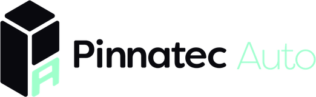
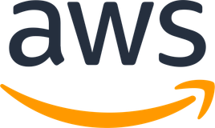

<div align="center">


[](https://aliyounes.dev) [](https://aliyounes.dev/resume) [](https://sideband.studio) [](https://www.linkedin.com/in/alialdoyounes/) [](mailto:younes.al@northeastern.edu)

</div>

<div align="center"></div>

## `> whoami`

Hi! I'm Ali, or you can call me Aldo. I'm a fourth year studying computer science and political science at Northeastern University in Boston, MA 📍.

I like to work with deeply architected systems. Most of my work tends to revolve around automating, but I usually just kinda build a solution to anything really 🤷‍♂️.

I have a 2013 Audi S4 that makes around 540 whp. It's on a Jackal Stage 2+ tune and I love to work on it myself :p.

<div align="center"></div>

## `> ls ./projects`

**[Eternal Monitor](https://github.com/whoisaldo/EternalMonitor)** · [eternalmonitor.dev](https://eternalmonitor.dev) · `Rust` `Swift` `Metal` 
> I refused to pay $40 for an iPad-as-second-display app that lagged. So I wrote my own. A Rust host captures the Windows desktop through DXGI, encodes H.264 on whatever silicon is in the machine, and sends every frame over UDP behind a 16-byte header I wrote. The iPad decodes on VideoToolbox and draws in Metal. No latency number yet, because I have not measured one.

**[Eternal Rich Presence](https://github.com/whoisaldo/Eternal-Rich-Presence)** · [eternalrichpresence.dev](https://eternalrichpresence.dev) · `Python` `Discord IPC` 
> Apple Music does not talk to Discord, and Listen Along is Spotify-only. This fixes both. pypresence is send-only, so I open Discord's IPC pipes over ctypes and speak the frame protocol by hand.

<div align="center"></div>

## `> history`

<table>
<tr><td align="center"></td><td><a href="https://github.com/philips-software"><b>Philips</b></a></td><td>SDE Co-op, System Integration</td><td>Jan 2026 to now</td></tr>
<tr><td align="center"><picture><source media="(prefers-color-scheme: dark)" srcset="./logos/pinnatec-dark.png"></picture></td><td><a href="https://pinnatecauto.com/"><b>Pinnatec Auto</b></a></td><td>Lead Full Stack Engineer, Virtual Link</td><td>Sep 2026 to now</td></tr>
<tr><td align="center"></td><td><a href="https://github.com/pawtograder"><b>Pawtograder</b></a></td><td>Backend Engineer, grading server</td><td>Aug 2026 to now</td></tr>
<tr><td align="center"><picture><source media="(prefers-color-scheme: dark)" srcset="./logos/aws-dark.png"></picture></td><td><a href="https://github.com/aws"><b>Amazon Web Services</b></a></td><td>SDE Intern, CloudFormation Registry</td><td>Jun to Sep 2026</td></tr>
<tr><td align="center"></td><td><a href="https://topchoicerealtyny.com/"><b>Top Choice Realty</b></a></td><td>Frontend Developer Intern</td><td>Apr to Aug 2024</td></tr>
<tr><td align="center"></td><td><a href="https://github.com/northeastern"><b>Northeastern</b></a></td><td>CS and Political Science, B.S.</td><td>class of 2027</td></tr>
</table>

<div align="center"></div>

## `> cat ./stack`

```
languages  Rust · Swift · TypeScript · Java · Python · C# · C++ · Go · PHP
web        React · React Native · Next.js · Node · Deno · Express · FastAPI
infra      AWS · Postgres · MongoDB · Supabase · Docker · Linux · GitHub Actions
ai         OpenAI SDK · Claude SDK · MCP · Bedrock · Ollama
```

<div align="center"></div>

## `> btop --user aldo`

<div align="center">


</div>
